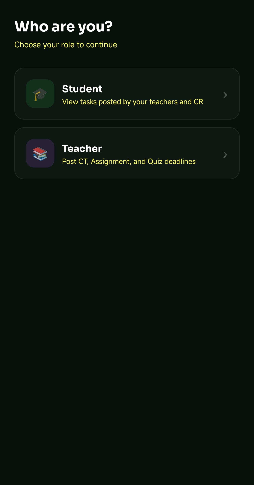

<div align="center">

# 📅 Deadline Tracker
### Student Task CT & Deadline Management — Android Application

[](https://developer.android.com)
[](https://www.java.com)
[](https://firebase.google.com)
[-informational?style=for-the-badge)](https://developer.android.com/tools/releases/platforms)
[](LICENSE)

> A role-based Android application that centralises academic deadline management for university students and faculty — replacing unreliable WhatsApp chains with structured, real-time, notification-driven task tracking.

</div>

---

## 📖 Table of Contents

- [The Problem](#-the-problem)
- [The Solution](#-the-solution)
- [Features](#-features)
- [Screenshots](#-screenshots)
- [User Roles](#-user-roles)
- [Tech Stack](#-tech-stack)
- [System Architecture](#-system-architecture)
- [Database Design](#-database-design)
- [How It Works](#-how-it-works)
- [Getting Started](#-getting-started)
- [Project Structure](#-project-structure)
- [Team](#-team)
- [Known Limitations](#-known-limitations)
- [Roadmap](#-roadmap)

---

## 🔥 The Problem

At **BAUET's CSE department**, students juggle Class Tests (CTs), assignments, and quizzes across multiple subjects every semester. The current way deadlines are communicated:

- A teacher tells the **Class Representative (CR)** via WhatsApp or Messenger
- The CR forwards the message to a noisy group chat
- Students miss the message — buried under memes, reactions, and off-topic threads

> In a 2023 informal survey of BAUET CSE students, **over 60% had missed at least one assignment deadline** in the previous semester due to a missed group chat message.

---

## ✅ The Solution

**Deadline Tracker** gives every stakeholder a dedicated, structured view of academic obligations:

| Who | What they get |
|---|---|
| 🧑‍🏫 **Teachers** | Post CTs, Assignments, and Quizzes to specific batches in under 30 seconds |
| 🎓 **Class Reps (CR)** | See and share all tasks posted for their batch |
| 📚 **Students** | A personalised dashboard of upcoming deadlines with real-time push notifications |

---

## ✨ Features

### For Students
- 🏠 **Home Dashboard** — colour-coded summary of Urgent / This Week / Completed tasks
- 🔔 **Push Notifications** — instant alert when a teacher posts a new task; 24-hour reminder before every deadline
- 📆 **Calendar View** — tap any date to see tasks due that day
- 👤 **Profile Settings** — update name and profile photo

### For Teachers
- ➕ **Post a Task** — fill in title, subject, type (CT / Assignment / Quiz), deadline, target batches, description, and optional PDF/image attachment
- 🗑️ **Manage Posted Tasks** — edit or delete tasks directly from the Settings screen
- 📊 **Dashboard Summary** — see total Classes, Assignments, and Quizzes at a glance
- 🔔 **Conflict Notifications** — notified when another teacher's task overlaps with yours

### For Class Representatives (CR)
- Same task visibility as students with an elevated view of all batch tasks
- Filter notifications by **All / Urgent / Today**

### System-wide
- ⚡ **Real-time sync** via Firebase Firestore — tasks appear on student dashboards within ~3 seconds of being posted
- 🎨 **Urgency colour coding** — 🔴 Overdue · 🟡 Due soon · 🟣 Upcoming · ✅ Completed
- 📴 **Offline caching** — previously loaded tasks remain viewable without internet

---

## 📸 Screenshots

<div align="center">

| Role Selection | Login | Student Registration |
|:---:|:---:|:---:|
|  |  |  |

| CR Registration | Teacher Registration | Student Dashboard |
|:---:|:---:|:---:|
|  |  |  |

| Student Notifications | Student Calendar | Student Settings |
|:---:|:---:|:---:|
|  |  |  |

| Teacher Dashboard | Post a Task | Teacher Notifications |
|:---:|:---:|:---:|
|  |  |  |

| Teacher Settings | Teacher Calendar |
|:---:|:---:|
|  |  |

</div>

> 📁 Place your screenshot files in a `/screenshots` folder in the repository root for the images above to render correctly.

---

## 👥 User Roles

```
Who are you?
├── 🎓  Student       → View tasks posted for your batch, receive notifications
├── 🧑‍🏫  Teacher       → Post tasks, manage your posted tasks, view all batch tasks
└── 📋  Class Rep (CR) → View & share tasks, cannot post — acts as a secondary relay
```

### Permissions Matrix

| Feature | Teacher | CR | Student |
|---|:---:|:---:|:---:|
| Post Tasks | ✅ | ❌ | ❌ |
| Edit / Delete Own Tasks | ✅ | ❌ | ❌ |
| View Batch Tasks | ✅ | ✅ | ✅ |
| Receive Push Notifications | ✅ | ✅ | ✅ |
| Calendar View | ✅ | ✅ | ✅ |
| Edit Profile | ✅ | ✅ | ✅ |

---

## 🛠 Tech Stack

| Layer | Technology | Purpose |
|---|---|---|
| Language | **Java** | Core application logic |
| IDE | **Android Studio** | Development environment |
| Cloud Database | **Firebase Firestore** | Real-time NoSQL document storage |
| Authentication | **Firebase Auth** | Email/password login with email verification |
| Notifications | **Firebase Cloud Messaging (FCM)** | Server-pushed deadline alerts |
| Backend Logic | **Firebase Cloud Functions** | Notification triggers & deadline reminders |
| Version Control | **GitHub** | Branch-based team collaboration |
| Min Platform | **Android 5.0 (API 21+)** | Broad device coverage |

---

## 🏗 System Architecture

```
┌─────────────────────────────────────────────────┐
│                 Android Client                  │
│  ┌──────────┐  ┌──────────┐  ┌──────────────┐  │
│  │ Teacher  │  │   CR     │  │   Student    │  │
│  │Dashboard │  │Dashboard │  │  Dashboard   │  │
│  └────┬─────┘  └────┬─────┘  └──────┬───────┘  │
│       └─────────────┼───────────────┘          │
│              Firebase Android SDK               │
└─────────────────────┬───────────────────────────┘
                      │ HTTPS / WebSocket
┌─────────────────────▼───────────────────────────┐
│              Firebase Backend                   │
│                                                 │
│  ┌─────────────┐   ┌──────────────────────────┐ │
│  │  Firestore  │   │    Cloud Functions        │ │
│  │  (Database) │◄──│  • onTaskCreate trigger   │ │
│  └─────────────┘   │  • Hourly reminder job    │ │
│                    └──────────────┬─────────────┘ │
│  ┌─────────────┐                  │               │
│  │  Firebase   │                  │               │
│  │    Auth     │   ┌──────────────▼─────────────┐ │
│  └─────────────┘   │  Firebase Cloud Messaging  │ │
│                    │       (FCM)                │ │
│                    └────────────────────────────┘ │
└─────────────────────────────────────────────────┘
```

---

## 🗄 Database Design

Firestore uses three main collections:

### `users`
```
users/{uid}
  ├── uid            : String   (Firebase Auth UID)
  ├── full_name      : String
  ├── role           : String   ("teacher" | "cr" | "student")
  ├── department     : String   (e.g. "CSE")
  ├── batch          : String   (e.g. "19")
  ├── email          : String
  └── fcm_token      : String   (for push notifications)
```

### `tasks`
```
tasks/{task_id}
  ├── task_id        : String
  ├── title          : String   (e.g. "DSA CT-1")
  ├── subject        : String
  ├── type           : String   ("CT" | "Assignment" | "Quiz")
  ├── deadline       : Timestamp
  ├── batch          : String[] (e.g. ["19", "20"])
  ├── department     : String
  ├── posted_by      : String   (uid of teacher)
  ├── description    : String
  └── attachment_url : String   (nullable)
```

### `notifications`
```
notifications/{notif_id}
  ├── notif_id  : String
  ├── task_id   : String
  ├── sent_at   : Timestamp
  └── status    : String   ("unread" | "read")
```

---

## ⚙️ How It Works

```
1. Teacher logs in  ──► Firebase Auth validates credentials
                         Role retrieved from users collection
                                    │
2. Teacher posts task ──────────────▼
   (title, type, deadline,    Written to tasks collection
    target batch, dept)            │
                                   │  Firestore trigger fires
                                   ▼
3. Cloud Function reads target batch ──► finds FCM tokens
                                         sends push notification
                                                │
4. Student receives notification ◄─────────────┘
   (even when app is closed)
                    │
5. Student opens app ──► Dashboard filters tasks by
                          own batch + department
                                    │
6. Hourly Cloud Function ───────────▼
   checks deadlines within 24 hrs ──► sends reminder if not
                                       already reminded
                                                │
7. After deadline passes ◄──────────────────────┘
   Task flagged "Deadline passed" · shown in red on dashboard
```

---

## 🚀 Getting Started

### Prerequisites
- Android Studio (Hedgehog 2023.1.1 or later recommended)
- JDK 11+
- A Firebase project with **Firestore**, **Authentication**, and **Cloud Messaging** enabled
- Git

### Setup

```bash
# 1. Clone the repository
git clone https://github.com/YOUR_USERNAME/deadline-tracker.git
cd deadline-tracker
```

```bash
# 2. Open in Android Studio
# File → Open → select the cloned folder
```

```
# 3. Connect Firebase
# Tools → Firebase → connect to your Firebase project
# Download google-services.json and place it in /app
```

```bash
# 4. Build & run
# Select a device/emulator and press ▶ Run
```

### Firebase Rules (Firestore)
```javascript
rules_version = '2';
service cloud.firestore {
  match /databases/{database}/documents {
    match /users/{uid} {
      allow read, write: if request.auth.uid == uid;
    }
    match /tasks/{taskId} {
      allow read: if request.auth != null;
      allow write: if get(/databases/$(database)/documents/users/$(request.auth.uid)).data.role == 'teacher';
    }
    match /notifications/{notifId} {
      allow read, write: if request.auth != null;
    }
  }
}
```

---

## 📁 Project Structure

```
deadline-tracker/
├── app/
│   ├── src/main/
│   │   ├── java/com/yourpackage/deadlinetracker/
│   │   │   ├── auth/               # Login, Registration activities
│   │   │   ├── teacher/            # Teacher dashboard, Post Task
│   │   │   ├── student/            # Student dashboard, Calendar
│   │   │   ├── common/             # Shared models, adapters, utils
│   │   │   └── notifications/      # FCM service, AlarmManager
│   │   ├── res/
│   │   │   ├── layout/             # XML UI layouts
│   │   │   ├── drawable/           # Icons, backgrounds
│   │   │   └── values/             # Colors, strings, themes
│   │   └── AndroidManifest.xml
│   └── google-services.json        # ← add your own (not committed)
├── screenshots/                    # App screenshots for README
├── functions/                      # Firebase Cloud Functions (Node.js)
│   └── index.js
├── .gitignore
└── README.md
```

---

## 👨‍💻 Team

| Member | Role | GitHub Branch |
|---|---|---|
| **Labib Hasan** | Database & Core Logic — SQLite/Firestore schema, CRUD operations, auth flow | `database-logic` |
| **Ashikur Rifat** | Notification System — FCM integration, AlarmManager, deadline alerts | `notification-system` |
| **Yasir Arafat** | UI & Navigation — XML layouts, RecyclerViews, dashboard screens | `ui-design` |

> Developed as a course project for **CSE-2216 Java Programming Laboratory**  
> Department of Computer Science & Engineering  
> **Bangladesh Army University of Engineering & Technology (BAUET)**

---

## ⚠️ Known Limitations

| Limitation | Details |
|---|---|
| 🌐 Internet required | Real-time updates need connectivity. Firestore offline cache shows stale data only. |
| 📱 Local completion only | Students cannot mark tasks complete server-side — progress resets on reinstall. |
| 📎 Single attachment | Post a Task supports one PDF or image per task. |
| ⚔️ No conflict detection | Teachers are not warned if two CTs are scheduled at the same time for the same batch. |
| 🔒 Basic security | No 2FA or institutional email domain restriction yet. |

---

## 🗺 Roadmap

- [ ] Institutional email restriction (`@bauet.ac.bd` only)
- [ ] Server-side task completion tracking per student
- [ ] In-app CT/deadline conflict detection for teachers
- [ ] Bulk semester schedule import (CSV / Excel)
- [ ] BAUET academic calendar integration (auto-skip holidays)
- [ ] Teacher analytics dashboard (views, acknowledgements per task)
- [ ] Web dashboard for teachers (browser-based task management)
- [ ] Two-factor authentication (OTP)
- [ ] Offline-first architecture with background sync queue
- [ ] Multi-university support via configurable department/batch settings

---

## 📄 License

This project is licensed under the [MIT License](LICENSE).

---

<div align="center">

Made with ☕ and late nights by the BAUET CSE Batch 19 team

⭐ Star this repo if it helped you · 🐛 [Report a bug](../../issues) · 💡 [Request a feature](../../issues)

</div>
